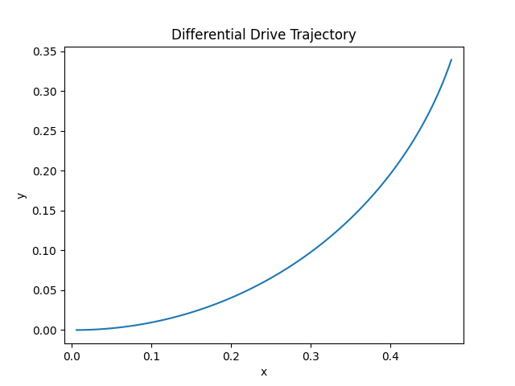
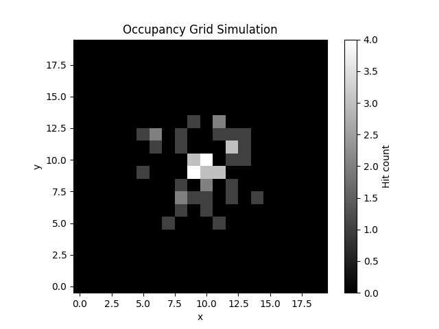
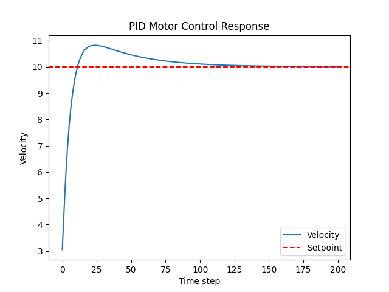
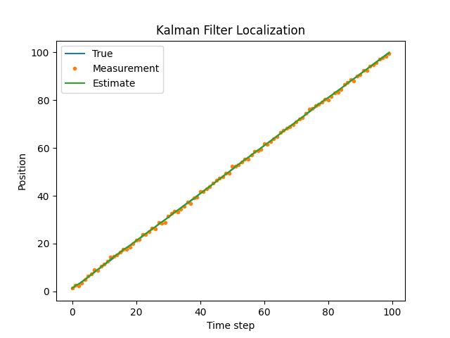

English | [Español](README.es.md)

# Robotics Simulations

Minimal simulation experiments exploring fundamental models and algorithms used in robotics systems.

This repository contains executable simulations illustrating how mobile robots move, estimate their state, and interact with uncertain environments. The goal is to demonstrate the **core engineering principles behind robotics algorithms** through both high-level prototyping (Python) and safety-critical implementation (Rust).

## Mathematical Rigor

Detailed formal derivations for the algorithms implemented in this laboratory (Kalman Filters, PID Stability, and Kinematics) can be found in [MATHEMATICAL_DERIVATIONS.md](./MATHEMATICAL_DERIVATIONS.md). This document bridges the gap between theoretical control theory and discrete-time execution.

## Contents

### Python Prototyping (`src/`)

- `differential_drive_kinematics.py`: Simulates the non-holonomic kinematic model of a differential-drive robot.
- `pid_motor_control.py`: Closed-loop velocity regulation using PID control.
- `simple_kalman_localization.py`: 1D State estimation under Gaussian noise using a Kalman Filter.
- `occupancy_grid_simulation.py`: Probabilistic mapping and spatial representation.

### High-Reliability Implementation (`rust-implementation/`)

- `pid_controller/`: A robust, panic-free implementation of a PID controller in **Rust**, focusing on safety-critical patterns and deterministic execution.

## Requirements

The examples use:

- Python 3.12+
- NumPy
- Matplotlib
- Rust toolchain (Cargo)

## Installation & usage

### Running the simulations

Clone the repository and run any of the scripts:

```bash
git clone https://github.com/Jorge-de-la-Flor/robotics-simulations
cd robotics-simulations
```

### Python installation

Install the required dependencies:

- using `pip`

```bash
pip install numpy matplotlib
```

- using `uv`

```bash
uv add numpy matplotlib
```

### Python usage

```bash
python src/pid-motor-control.py
```

### Rust installation

No dependencies crates required

### Rust usage

```bash
cd rust-implementation/pid_controller
cargo run
```

Some simulations generate plots to visualize the behaviour of the system.

## Example Output






## Project tree

```bash
robotics-simulations
├─ .python-version
├─ LICENSE
├─ MATHEMATICAL_DERIVATIONS.es.md
├─ MATHEMATICAL_DERIVATIONS.md
├─ README.es.md
├─ README.md
├─ assets
│  ├─ differential-drive-kinematics.png
│  ├─ occupancy-grid-simulation.png
│  ├─ pid-motor-control.png
│  └─ simple-kalman-localization.png
├─ pyproject.toml
├─ rust-implementation
│  └─ pid_controller
│     ├─ Cargo.lock
│     ├─ Cargo.toml
│     └─ src
│        └─ main.rs
├─ src
│  ├─ differential-drive-kinematics.py
│  ├─ occupancy-grid-simulation.py
│  ├─ pid-motor-control.py
│  └─ simple-kalman-localization.py
└─ uv.lock
```

## Purpose

These experiments illustrate engineering concepts relevant to:

- Mobile robot kinematics
- Feedback control systems
- Probabilistic state estimation
- Robot localization
- Environment representation

## Motivation

Robotic systems operate in dynamic and uncertain environments. Engineers must design algorithms capable of estimating system states, controlling actuators, and building internal representations of the world.

Simulation is an essential tool for understanding these algorithms before deploying them on real hardware. By experimenting with simplified models, it becomes easier to reason about system behaviour, stability, and robustness.

This repository explores these ideas through small and interpretable experiments.

## Method

Each experiment implements a simplified mathematical model commonly used in robotics.

The simulations include:

- kinematic models of mobile robots
- closed-loop control using PID regulation
- probabilistic estimation using Kalman filtering
- grid-based environment representation

The implementations are intentionally minimal and prioritise clarity over completeness.

The goal is to expose the **structure of robotics algorithms** in a way that is easy to inspect, modify, and experiment with.

## References

- Thrun, S., Burgard, W., & Fox, D. (2005).
  _Probabilistic Robotics._

- Siegwart, R., Nourbakhsh, I., & Scaramuzza, D. (2011).
  _Introduction to Autonomous Mobile Robots._

- Corke, P. (2017).
  _Robotics, Vision and Control._

## License

MIT License | 2026
